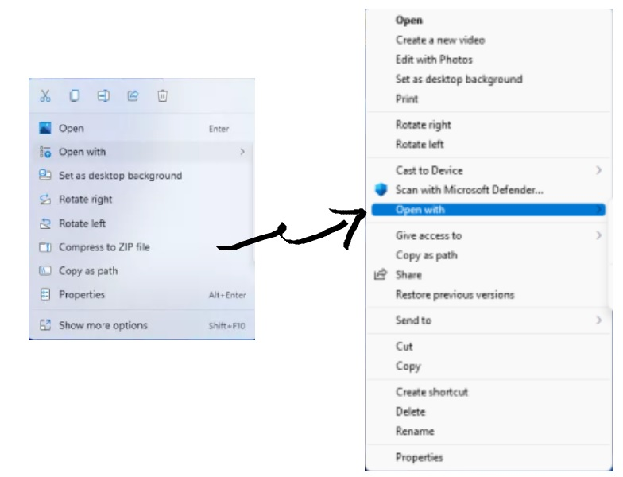

# Old_Right_Click_Menu_For_Win11

A batch file restoring Windows 11's redesigned context menus to their full, classic functionality.

Running the contents of the article below in a batch file.

https://www.pcgamer.com/windows-11-context-menu-fix-right-click/ 

## install

1. Download or git clone this repo. -> [download](https://github.com/h1day/Old_Right_Click_Menu_For_Win11/archive/refs/tags/v0.1.zip)

1. Run "install.bat".

1. Microsoft Defender will block this. Click "More info" to see "Run anyway".

## uninstall

1. Run "uninstall.bat" .

1. Microsoft Defender will block this. Click "More info" to see "Run anyway".

## references

https://www.pcgamer.com/windows-11-context-menu-fix-right-click/

https://docs.microsoft.com/en-us/windows-server/administration/windows-commands/reg-add

https://docs.microsoft.com/en-us/windows-server/administration/windows-commands/reg-delete
